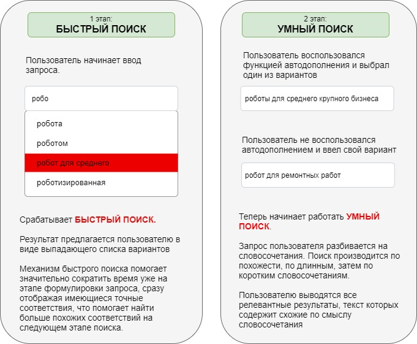

## Document searching algorithm
#### Document search for Russian language

----
Поисковый алгоритм для поиска документов в базе. Алгоритм является комбинацией поиска по префиксному дереву, результаты которого используются для формирования выпадающего листа с подсказками, и поиска по похожести (ngrams, bert, tfidf, fuzzywuzzy)

[ссылка на демо](https://share.streamlit.io/cybermaryver/docssearch/app.py)

